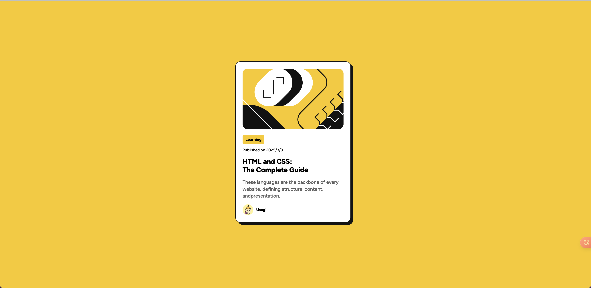
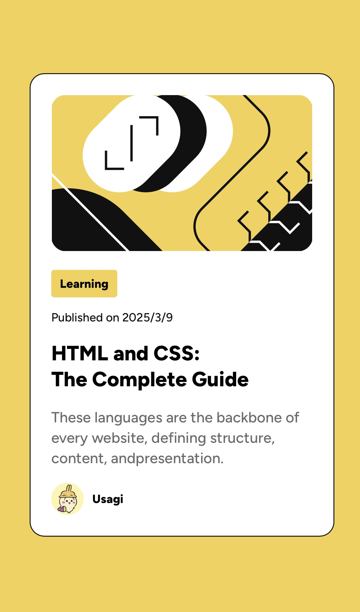

# Frontend Mentor - Blog 预览卡挑战解决方案

这是 [Frontend Mentor 上的 Blog 预览卡挑战](https://www.frontendmentor.io/challenges/blog-preview-card-ckPaj01IcS)的解决方案。

## 目录

-   [概述](#概述)
    -   [截图](#截图)
-   [我的开发过程](#我的开发过程)
    -   [使用的技术](#使用的技术)
    -   [学到的知识](#学到的知识)
    -   [未来的改进方向](#未来的改进方向)
    -   [参考资料](#参考资料)

## 概述

该项目的目的是构建一个响应式的博客预览卡组件，专注于在不同设备上的用户体验。

### 截图




## 我的开发过程

### 使用的技术

-   响应式设计
-   Hover 效果
-   基础的 JavaScript 用于时间显示

### 学到的知识

-   如何使用 CSS Flexbox 技术来布置内容。
-   使用 `@font-face` 添加自定义字体：

    ```css
    @font-face {
        font-family: "Figtree";
        src: url("./assets/fonts/static/Figtree-Medium.ttf") format("truetype");
    }
    ```

-   如何通过简单的 JavaScript 获取和显示当前日期：

    ```javascript
    const dateYear = document.querySelector(".yr-mo");
    const currentDate = new Date().toLocaleDateString();
    dateYear.textContent = currentDate;
    ```

-   通过使用`:hover` 选择器来实现悬停效果：
    ```css
    .card-box:hover {
        box-shadow: 0.5rem 0.5rem #121212;
        transform: translate(-0.5rem, -0.5rem);
    }
    ```

### 未来的改进方向

-   学习并应用 CSS Grid 来增强布局能力。
-   探索更多关于动画效果和过渡效果的知识，提升用户体验。

### 参考资料

-   [CSS Flexbox 指南](https://css-tricks.com/snippets/css/a-guide-to-flexbox/)
-   [Font-Face 装载自定义字体](https://developer.mozilla.org/en-US/docs/Web/CSS/@font-face)
-   [获取当前日期和时间](https://developer.mozilla.org/en-US/docs/Web/JavaScript/Reference/Global_Objects/Date/toLocaleDateString)

---

# Frontend Mentor - Blog Preview Card Challenge Solution

This is the solution for the [Blog Preview Card Challenge](https://www.frontendmentor.io/challenges/blog-preview-card-ckPaj01IcS) on Frontend Mentor.

## Table of Contents

-   [Overview](#overview)
    -   [Screenshots](#screenshots)
-   [My Development Process](#my-development-process)
    -   [Technologies Used](#technologies-used)
    -   [What I Learned](#what-i-learned)
    -   [Future Improvements](#future-improvements)
    -   [References](#references)

## Overview

The objective of this project is to build a responsive blog preview card component, focusing on user experience across different devices.

### Screenshots


## My Development Process

### Technologies Used

-   Responsive Design
-   Hover Effects
-   Basic JavaScript for displaying date

### What I Learned

-   How to use CSS Flexbox to layout content.
-   Adding custom fonts using `@font-face`:

    ```css
    @font-face {
        font-family: "Figtree";
        src: url("./assets/fonts/static/Figtree-Medium.ttf") format("truetype");
    }
    ```

-   How to get and display the current date using simple JavaScript:

    ```javascript
    const dateYear = document.querySelector(".yr-mo");
    const currentDate = new Date().toLocaleDateString();
    dateYear.textContent = currentDate;
    ```

-   Implementing hover effects using the `:hover` selector:
    ```css
    .card-box:hover {
        box-shadow: 0.5rem 0.5rem #121212;
        transform: translate(-0.5rem, -0.5rem);
    }
    ```

### Future Improvements

-   Learn and apply CSS Grid to enhance layout capabilities.
-   Explore more about animation effects and transition effects to improve user experience.

### References

-   [A Complete Guide to Flexbox](https://css-tricks.com/snippets/css/a-guide-to-flexbox/)
-   [Using @font-face](https://developer.mozilla.org/en-US/docs/Web/CSS/@font-face)
-   [Getting and Using Dates in JavaScript](https://developer.mozilla.org/en-US/docs/Web/JavaScript/Reference/Global_Objects/Date/toLocaleDateString)
