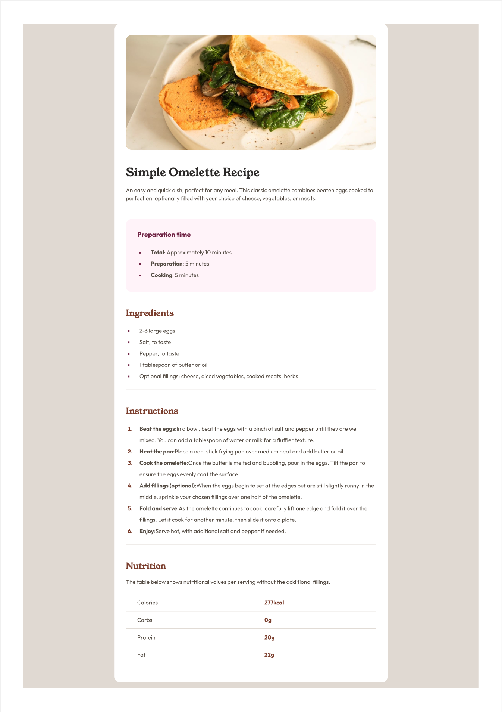
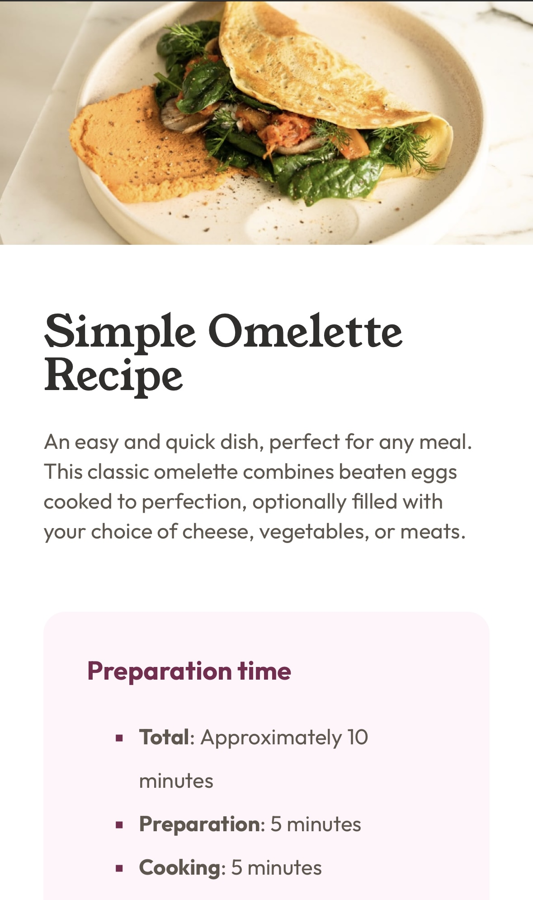

# Frontend Mentor - 食谱页面解决方案

这是 [Frontend Mentor 上的食谱页面挑战](https://www.frontendmentor.io/challenges/recipe-page-KiTsR8QQKm)的解决方案。Frontend Mentor 挑战帮助你通过构建真实项目来提升编码技能。

## 目录

-   [概述](#概述)
    -   [项目目标](#项目目标)
    -   [截图](#截图)
-   [开发过程](#开发过程)
    -   [使用技术](#使用技术)
    -   [主要功能](#主要功能)
    -   [学到的知识](#学到的知识)
    -   [参考资料](#参考资料)

---

## 概述

### 项目目标

本项目的目标是使用 **Sass (SCSS)** 创建一个 **响应式食谱页面**，拥有清晰的布局结构，并能适应不同屏幕尺寸，为用户提供直观的体验。

### 截图

#### **桌面端**



#### **移动端**



---

## 开发过程

### 使用技术

-   **语义化 HTML5**
-   **Flexbox & CSS Grid**
-   **Sass (SCSS)**
-   **媒体查询以适配不同设备**

### 主要功能

1. **响应式布局**

    - 使用 **Flexbox** 创建动态、适应性强的页面结构。

2. **SCSS 功能实现**

    - **颜色 & 字体变量**
        ```scss
        $color-rose-light: hsl(330, 100%, 98%);
        $font-outfit: "Outfit", sans-serif;
        ```
    - **Mixin 复用样式**
        ```scss
        @mixin flex-center {
            display: flex;
            flex-direction: column;
            justify-content: center;
            gap: 3rem;
        }
        ```
    - **嵌套结构，优化代码层次**
        ```scss
        .recipe-card {
            background-color: $color-rose-light;
            padding: 2rem;
            border-radius: 10px;
            h3 {
                font-size: 1.2rem;
                color: $color-rose;
            }
        }
        ```

---

### 学到的知识

通过此项目，我学习并实践了：

-   **使用 Sass 变量和 Mixin** 来优化 CSS 代码结构。
-   **Sass 嵌套** 结构，提高代码可读性。
-   **优化 CSS 代码，使其更具灵活性和可扩展性**。

---

### 参考资料

-   [Sass 官方文档](https://sass-lang.com/documentation) - SCSS 语法及最佳实践指南。

---

# Frontend Mentor - Recipe Page Solution

This is a solution to the [Recipe page challenge on Frontend Mentor](https://www.frontendmentor.io/challenges/recipe-page-KiTsR8QQKm). Frontend Mentor challenges help you improve your coding skills by building real-world projects.

## Table of Contents

-   [Overview](#overview)
    -   [Project Goal](#project-goal)
    -   [Screenshots](#screenshots)
-   [Development Process](#development-process)
    -   [Technologies Used](#technologies-used)
    -   [Key Features](#key-features)
    -   [Lessons Learned](#lessons-learned)
    -   [References](#references)

---

## Overview

### Project Goal

The goal of this project is to create a **responsive recipe page** using **Sass (SCSS)**, with a clear layout structure that adapts well to different screen sizes and provides an intuitive user experience.

### Screenshots

#### **Desktop Version**


#### **Mobile Version**


---

## Development Process

### Technologies Used

-   **Semantic HTML5**
-   **Flexbox & CSS Grid**
-   **Sass (SCSS)**
-   **Media Queries for Responsive Design**

### Key Features

1. **Responsive Layout**

    - Utilized **Flexbox** to create a dynamic and adaptable page structure.

2. **SCSS Implementations**

    - **Color & Font Variables**
        ```scss
        $color-rose-light: hsl(330, 100%, 98%);
        $font-outfit: "Outfit", sans-serif;
        ```
    - **Mixin for Reusable Styles**
        ```scss
        @mixin flex-center {
            display: flex;
            flex-direction: column;
            justify-content: center;
            gap: 3rem;
        }
        ```
    - **Nested Structure for Clean Code Organization**
        ```scss
        .recipe-card {
            background-color: $color-rose-light;
            padding: 2rem;
            border-radius: 10px;
            h3 {
                font-size: 1.2rem;
                color: $color-rose;
            }
        }
        ```

---

### Lessons Learned

Through this project, I have practiced and improved:

-   **Using Sass variables and mixins** to optimize CSS structure.
-   **Sass nesting** for better code readability.
-   **Optimizing CSS code** to make it more flexible and scalable.

---

### References

-   [Sass Official Documentation](https://sass-lang.com/documentation) - SCSS syntax and best practices guide.

---
