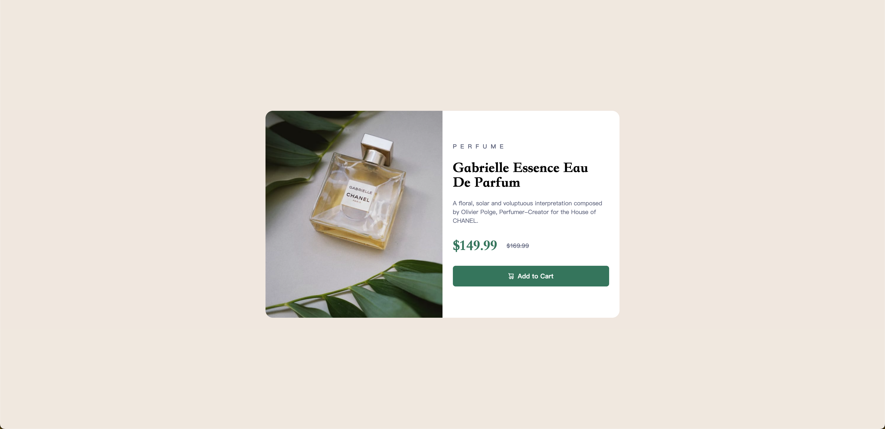

# Frontend Mentor - 产品预览卡片组件项目说明（中文）

## 目录

-   [项目概览](#项目概览)
    -   [项目截图](#项目截图)
-   [我的开发流程](#我的开发流程)
    -   [使用的技术](#使用的技术)
    -   [我学到的内容](#我学到的内容)
    -   [示例代码片段](#示例代码片段)
-   [参考资料](#参考资料)
-   [作者信息](#作者信息)

这是我为 [Frontend Mentor 的产品预览卡片组件挑战](https://www.frontendmentor.io/challenges/product-preview-card-component-GO7UmttRfa) 编写的解决方案。

## 项目概览

### 项目截图




## 我的开发流程

### 使用的技术

-   Tailwind CSS
-   响应式设计（移动端优先）

### 我学到的内容

-   为项目安装 Tailwind CSS 并进行基本配置
-   如何使用 Tailwind CSS 快速构建一个响应式的产品卡片组件；
-   使用 Tailwind 的 `hover:`, `transition`, `line-through` 等类，实现更丰富的样式表现；
-   如何用 Tailwind 进行布局对齐与内容间距管理。

#### 示例代码片段

```html
<!-- 图片区域响应式设置 -->
<div
    class="w-full h-[40vh] md:w-1/2 md:h-full bg-center bg-cover bg-[url('/images/image-product-mobile.jpg')] md:bg-[url('/images/image-product-desktop.jpg')] rounded-t-[1rem] md:rounded-l-[1rem] md:rounded-t-none overflow-hidden"></div>
```

```html
<!-- 按钮 hover 效果 -->
<button
    class="bg-green500 hover:bg-green700 active:bg-green700 transition-colors duration-300 text-white font-bold rounded-md p-3">
    Add to Cart
</button>
```

### 参考资料

-   [Tailwind CSS 官方文档](https://tailwindcss.com/)

---

# Frontend Mentor - Product Preview Card Component Solution (English)

## Table of Contents

-   [Project Overview](#project-overview)
    -   [Screenshots](#screenshots)
-   [My Development Process](#my-development-process)
    -   [Technologies Used](#technologies-used)
    -   [What I Learned](#what-i-learned)
    -   [Code Snippets](#code-snippets)
-   [References](#references)
-   [Author Information](#author-information)

This is my solution to the [Frontend Mentor Product Preview Card Challenge](https://www.frontendmentor.io/challenges/product-preview-card-component-GO7UmttRfa).

## Project Overview

### Screenshots


## My Development Process

### Technologies Used

-   Tailwind CSS
-   Responsive Design (Mobile-first)

### What I Learned

-   Installed Tailwind CSS and set up basic configuration for the project
-   Learned how to use Tailwind CSS to quickly build a responsive product card component
-   Implemented rich styles using Tailwind classes like `hover:`, `transition`, and `line-through`
-   Managed layout alignment and spacing with Tailwind

#### Code Snippets

```html
<!-- Responsive Image Area -->
<div
    class="w-full h-[40vh] md:w-1/2 md:h-full bg-center bg-cover bg-[url('/images/image-product-mobile.jpg')] md:bg-[url('/images/image-product-desktop.jpg')] rounded-t-[1rem] md:rounded-l-[1rem] md:rounded-t-none overflow-hidden"></div>
```

```html
<!-- Button Hover Effect -->
<button
    class="bg-green500 hover:bg-green700 active:bg-green700 transition-colors duration-300 text-white font-bold rounded-md p-3">
    Add to Cart
</button>
```

### References

-   [Tailwind CSS Official Documentation](https://tailwindcss.com/)
