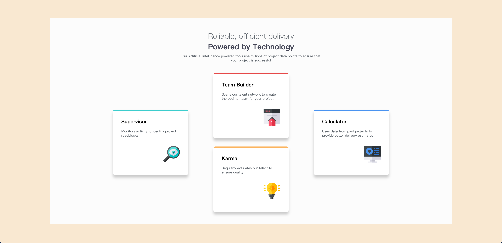

# Frontend Mentor - 四卡片功能区块 解决方案

这是我为 [Frontend Mentor 上的 Four card feature section 挑战](https://www.frontendmentor.io/challenges/four-card-feature-section-weK1eFYK) 完成的解决方案。Frontend Mentor 的挑战可以帮助你通过构建真实项目来提升前端技能。

## 目录

-   [项目概述](#项目概述)
    -   [页面截图](#页面截图)
-   [我的开发过程](#我的开发过程)
    -   [使用技术](#使用技术)
    -   [学到的内容](#学到的内容)

## 项目概述

### 页面截图




## 我的开发过程

### 使用技术

-   语义化 HTML5
-   SCSS 自定义属性
-   CSS Grid

### 学到的内容

练习了框架思维，使用 Sass 创建了文件夹，并按照自己的理解分类文件夹。

```plaintext
sass/
├── abstracts/
│   └── _var.scss
├── base/
│   └── _base.scss
│   └── _typography.scss
├── components/
│   └── _card.scss
├── layouts/
│   └── _card-container.scss
│   └── header.scss
└── main.scss
```

---

# Frontend Mentor - Four Card Feature Section Solution

This is my solution to the [Four Card Feature Section challenge on Frontend Mentor](https://www.frontendmentor.io/challenges/four-card-feature-section-weK1eFYK). These challenges help you improve your front-end skills by building real projects.

## Table of Contents

-   [Project Overview](#project-overview)
    -   [Screenshots](#screenshots)
-   [My Development Process](#my-development-process)
    -   [Technologies Used](#technologies-used)
    -   [What I Learned](#what-i-learned)

## Project Overview

### Screenshots


## My Development Process

### Technologies Used

-   Semantic HTML5
-   SCSS custom properties
-   CSS Grid

### What I Learned

I practiced framework thinking and used Sass to create a folder structure, organizing files based on my understanding.

```plaintext
sass/
├── abstracts/
│   └── _var.scss
├── base/
│   └── _base.scss
│   └── _typography.scss
├── components/
│   └── _card.scss
├── layouts/
│   └── _card-container.scss
│   └── header.scss
└── main.scss
```
