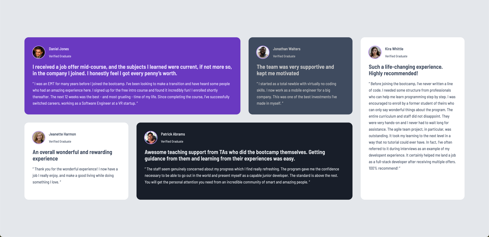

# Frontend Mentor - 推荐网格部分解决方案

这是我对 [Frontend Mentor 上的推荐网格部分挑战](https://www.frontendmentor.io/challenges/testimonials-grid-section-Nnw6J7Un7)的解决方案。Frontend Mentor 提供的挑战可以帮助你通过构建现实项目来提高你的编码技能，特别是响应式设计技能。

## 目录

-   [概述](#概述)
    -   [截图](#截图)
    -   [链接](#链接)
-   [开发过程](#开发过程)
    -   [使用的技术](#使用的技术)
    -   [学习收获](#学习收获)
    -   [未来改进](#未来改进)
    -   [资源链接](#资源链接)

## 概述

### 截图




## 开发过程

### 使用的技术

-   **语义化 HTML5**
-   使用自定义属性的 **CSS**
-   布局采用 **CSS Grid** 和 **Flexbox**

### 学习收获

在完成这个项目的过程中，我提升了以下技能：

-   利用 CSS Grid 和 Flexbox 创建响应式布局。
-   通过模块化样式表创建可复用的 CSS 组件。

以下是我特别满意的一个 CSS 组件示例：

```css
.card-shadow:hover {
    cursor: pointer;
    box-shadow: 2rem 2rem 20px rgba(0, 0, 0, 0.2);
    transform: translate(-5px, -5px);
}
```

### 资源链接

-   [CSS Tricks: A Complete Guide to Grid](https://css-tricks.com/snippets/css/complete-guide-grid/) - 这篇指南内容非常全面，是学习 CSS Grid 布局的极佳资源。
-   [MDN Web Docs](https://developer.mozilla.org/) - 理解各种 CSS 属性及其浏览器兼容性的常用参考。

---

# Frontend Mentor - Testimonials Grid Section Solution

This is my solution to the [Testimonials Grid Section Challenge on Frontend Mentor](https://www.frontendmentor.io/challenges/testimonials-grid-section-Nnw6J7Un7). The challenges provided by Frontend Mentor help you improve your coding skills by building real projects, particularly focusing on responsive design.

## Table of Contents

-   [Overview](#overview)
    -   [Screenshots](#screenshots)
    -   [Links](#links)
-   [Process](#process)
    -   [Technologies Used](#technologies-used)
    -   [Key Learnings](#key-learnings)
    -   [Future Improvements](#future-improvements)
    -   [Resources](#resources)

## Overview

### Screenshots


## Process

### Technologies Used

-   **Semantic HTML5**
-   **CSS** with custom properties
-   Layout using **CSS Grid** and **Flexbox**

### Key Learnings

Throughout the completion of this project, I enhanced the following skills:

-   Creating responsive layouts using CSS Grid and Flexbox.
-   Building reusable CSS components through modular stylesheets.

Here's a CSS component that I am particularly proud of:

```css
.card-shadow:hover {
    cursor: pointer;
    box-shadow: 2rem 2rem 20px rgba(0, 0, 0, 0.2);
    transform: translate(-5px, -5px);
}
```

### Resources

-   [CSS Tricks: A Complete Guide to Grid](https://css-tricks.com/snippets/css/complete-guide-grid/)
-   [MDN Web Docs](https://developer.mozilla.org/)
