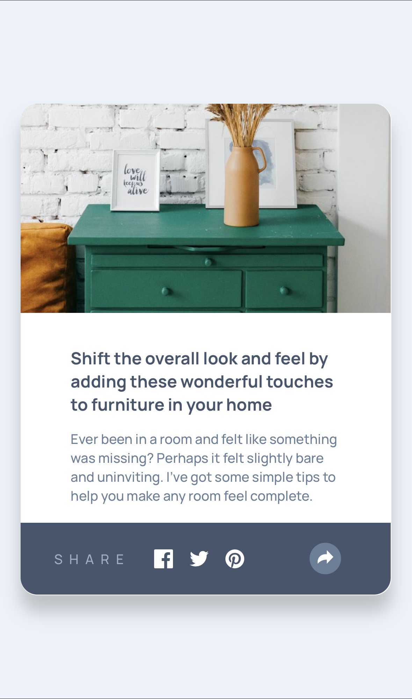
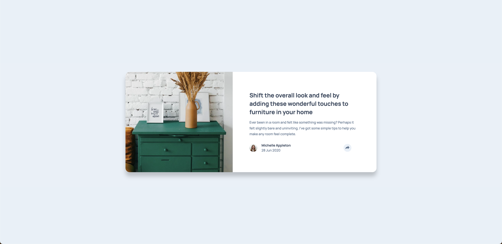

# Frontend Mentor - 文章预览组件解决方案

这是 [Frontend Mentor 上的文章预览组件挑战](https://www.frontendmentor.io/challenges/article-preview-component-dYBN_pYFT) 的解决方案。

## 目录

-   [概述](#概述)

    -   [项目截图](#项目截图)

-   [我的开发过程](#我的开发过程)

    -   [开发技术](#开发技术)
    -   [学习心得](#学习心得)
    -   [相关资源](#相关资源)

## 概述

### 项目截图

<div class="row" style="display: flex; flex-wrap: wrap; gap: 20px;">



</div>

## 我的开发过程

### 开发技术

-   语义化 HTML5 标签
-   SCSS 预处理器
-   Flexbox 弹性布局
-   移动端优先的响应式设计
-   JavaScript DOM 操作和事件处理

### 学习心得

在这个项目中，我主要学习了以下几点：

#### 1. 响应式社交分享卡片设计

实现了在不同设备上展现不同交互效果的社交分享组件：

##### 移动端设计

-   采用全屏宽度的底部滑出式面板
-   关键特性：
    -   绝对定位实现底部固定
    -   平滑的上下滑动过渡动画
    ```scss
    .social-card-moblie {
        width: 100%;
        position: absolute;
        bottom: 0;
        left: 0;
        transform: translate(0, 100%);
        transition: all 0.3s ease-in-out;
    }
    ```

##### 桌面端设计

-   采用轻量气泡式设计
-   特色功能：

    -   自适应宽度的卡片
    -   圆角和阴影效果
    -   带有指向性的三角形装饰

    ```scss
    @media (min-width: 1440px) {
        .social-card-moblie {
            width: auto;
            border-radius: 2rem;
            box-shadow: 0 0.2rem 0.8rem rgba(0, 0, 0, 0.2);
            transform: translate(4%, 150%) scale(0);

            &::after {
                content: "";
                position: absolute;
                border-top: 8px solid $dark-blue;
                // 三角形样式
            }
        }
    }
    ```

#### 2. 技术要点

-   **CSS 变换与过渡**：
    -   使用 `transform` 实现平移和缩放
    -   添加 `transition` 实现平滑动画效果
-   **伪元素应用**：

    -   使用 `::after` 伪元素创建气泡指示箭头
    -   通过 border 属性构建三角形

-   **响应式设计思维**：
    -   采用移动优先的开发方式
    -   通过媒体查询适配不同设备尺寸
    -   灵活运用相对单位确保布局弹性

### 相关资源

-   [CSS-Tricks - Flexbox 完全指南](https://css-tricks.com/snippets/css/a-guide-to-flexbox/) - 帮助我理解 Flexbox 布局
-   [MDN Web Docs](https://developer.mozilla.org/) - JavaScript DOM 操作参考

---

# Frontend Mentor - Article Preview Component Solution

This is a solution to the [Article Preview Component challenge on Frontend Mentor](https://www.frontendmentor.io/challenges/article-preview-component-dYBN_pYFT).

## Table of contents

-   [Overview](#overview)
    -   [Screenshot](#screenshot)
-   [My process](#my-process)
    -   [Built with](#built-with)
    -   [What I learned](#what-i-learned)
    -   [Useful resources](#useful-resources)

## Overview

### Screenshot

<div class="row" style="display: flex; flex-wrap: wrap; gap: 20px;">


</div>

## My process

### Built with

-   Semantic HTML5 markup
-   SCSS preprocessor
-   Flexbox
-   Mobile-first responsive design
-   JavaScript DOM manipulation and event handling

### What I learned

Here are the key learnings from this project:

#### 1. Responsive Social Share Card Design

Implemented a social sharing component with different interaction effects across devices:

##### Mobile Design

-   Full-width bottom slide-up panel
-   Key features:
    -   Fixed bottom positioning using absolute positioning
    -   Smooth slide up/down transition animations
    ```scss
    .social-card-moblie {
        width: 100%;
        position: absolute;
        bottom: 0;
        left: 0;
        transform: translate(0, 100%);
        transition: all 0.3s ease-in-out;
    }
    ```

##### Desktop Design

-   Lightweight tooltip-style design
-   Featured functionalities:

    -   Auto-width card
    -   Rounded corners and shadow effects
    -   Directional triangle decoration

    ```scss
    @media (min-width: 1440px) {
        .social-card-moblie {
            width: auto;
            border-radius: 2rem;
            box-shadow: 0 0.2rem 0.8rem rgba(0, 0, 0, 0.2);
            transform: translate(4%, 150%) scale(0);

            &::after {
                content: "";
                position: absolute;
                border-top: 8px solid $dark-blue;
                // Triangle styling
            }
        }
    }
    ```

#### 2. Technical Highlights

-   **CSS Transforms & Transitions**:

    -   Used `transform` for translation and scaling
    -   Added `transition` for smooth animation effects

-   **Pseudo-element Applications**:

    -   Utilized `::after` pseudo-element for tooltip arrow
    -   Created triangle shapes using border properties

-   **Responsive Design Philosophy**:
    -   Adopted mobile-first development approach
    -   Implemented media queries for device adaptation
    -   Applied relative units for flexible layouts

### Useful resources

-   [CSS-Tricks - Complete Guide to Flexbox](https://css-tricks.com/snippets/css/a-guide-to-flexbox/) - Helped me understand Flexbox layout
-   [MDN Web Docs](https://developer.mozilla.org/) - Reference for JavaScript DOM manipulation
