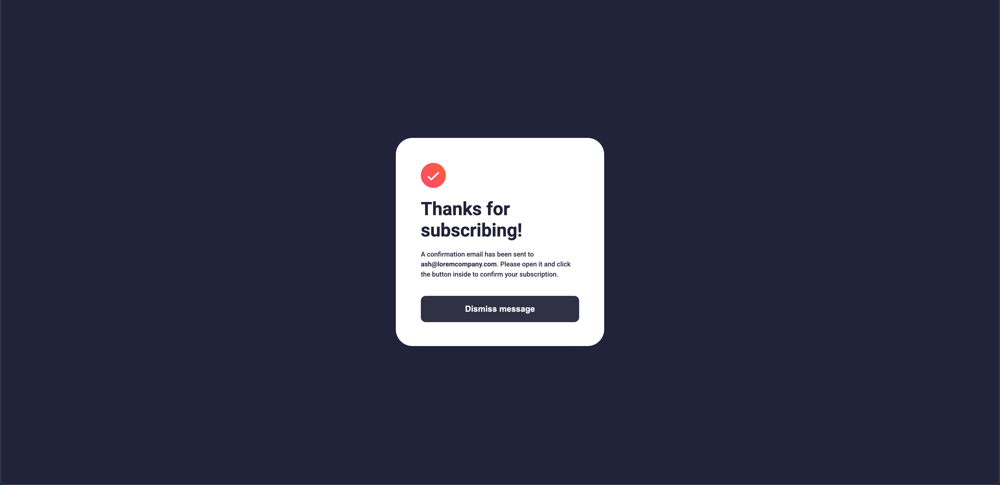

# Newsletter 订阅表单项目 - 成功提交提示版

这是我在 [Frontend Mentor](https://www.frontendmentor.io/challenges/newsletter-signup-form-with-success-message-3FC1AZbNrv) 上完成的练习项目，主要目的是练习 **表单验证、DOM 操作、响应式布局与用户交互设计**。

-   [项目功能需求](#项目功能需求)
-   [项目截图](#项目截图)
-   [技术实现](#技术实现)
-   [使用的知识](#使用的知识)
-   [后续优化方向](#后续优化方向)
-   [参考资料](#参考资料)

---

## 项目功能需求

用户可以：

-   输入邮箱并提交表单
-   在邮箱有效时，看到一个成功提交的界面
-   在邮箱为空或格式不正确时，看到提示信息
-   根据设备尺寸查看适配布局
-   所有交互元素具有 hover / focus 效果

---

## 项目截图




---

## 技术实现

### 使用技术：

-   原生 HTML + CSS（模块化结构）
-   CSS 自定义属性（变量）
-   `insertAdjacentHTML()` 添加 DOM 元素
-   正则表达式判断邮箱格式
-   CSS 动画（果冻弹出效果）

---

## 使用的知识

-   ✅ **邮箱格式验证**：
    使用正则表达式 `/^[^\s@]+@[^\s@]+\.[^\s@]+$/` 判断格式是否正确。

-   ✅ **错误信息避免重复添加**：
    判断 `.error-msg` 是否已经存在，避免多次插入提示。

-   ✅ **placeholder 颜色动态变更**：
    通过 `.red-placeholder::placeholder` 控制 placeholder 样式。

-   ✅ **果冻弹出动画**：
    使用 `@keyframes pop` 模拟弹性弹出视觉效果。

```js
const isCorrectEmail = /^[^\s@]+@[^\s@]+\.[^\s@]+$/.test(input.value);
if (!isCorrectEmail && !document.querySelector(".error-msg")) {
    const errorHtml = `<p class="card-label-text error-msg">Please provide a valid email address.</p>`;
    labelBox.insertAdjacentHTML("beforeend", errorHtml);
}
```

---

## 后续优化方向

-   将验证逻辑封装为模块
-   增加键盘提交与 Enter 支持
-   添加动画“轻量模式”（`prefers-reduced-motion`）
-   增加对多个输入框或多步骤表单的拓展能力

---

## 参考资料

-   [MDN - insertAdjacentHTML() 使用方法](https://developer.mozilla.org/zh-CN/docs/Web/API/Element/insertAdjacentHTML)
-   [正则表达式验证邮箱](https://regexr.com/)
-   [CSS placeholder 样式详解](https://developer.mozilla.org/zh-CN/docs/Web/CSS/::placeholder)

---

# Newsletter Sign-up Form Project - With Success Message

This is my solution to the [Frontend Mentor challenge](https://www.frontendmentor.io/challenges/newsletter-signup-form-with-success-message-3FC1AZbNrv), focused on practicing **form validation, DOM manipulation, responsive layout, and user interaction design**.

## Table of Contents

-   [Features](#features)
-   [Screenshots](#screenshots)
-   [Implementation](#implementation)
-   [What I Learned](#what-i-learned)
-   [Future Improvements](#future-improvements)
-   [References](#references)

---

## Features

Users can:

-   Enter their email and submit the form
-   See a success screen when a valid email is submitted
-   See an error message if the email is empty or invalid
-   View responsive design on different screen sizes
-   Experience hover and focus states on interactive elements

---

## Screenshots


---

## Implementation

### Built With:

-   Vanilla HTML + CSS (modular structure)
-   CSS custom properties (variables)
-   `insertAdjacentHTML()` for injecting DOM elements
-   Regular expression for email validation
-   CSS animation for jelly-like pop-up effect

---

## What I Learned

-   ✅ **Email validation**
    Used regex `/^[^\s@]+@[^\s@]+\.[^\s@]+$/` to validate the format.

-   ✅ **Prevent duplicate error messages**
    Checked for existing `.error-msg` before appending.

-   ✅ **Dynamic placeholder color**
    Controlled by `.red-placeholder::placeholder`.

-   ✅ **Jelly popup animation**
    Created using `@keyframes pop`.

```js
const isCorrectEmail = /^[^\s@]+@[^\s@]+\.[^\s@]+$/.test(input.value);
if (!isCorrectEmail && !document.querySelector(".error-msg")) {
    const errorHtml = `<p class="card-label-text error-msg">Please provide a valid email address.</p>`;
    labelBox.insertAdjacentHTML("beforeend", errorHtml);
}
```

---

## Future Improvements

-   Modularize validation logic
-   Add keyboard (Enter key) support
-   Support reduced motion using `prefers-reduced-motion`
-   Extend for multi-field or multi-step forms

---

## References

-   [MDN - insertAdjacentHTML()](https://developer.mozilla.org/en-US/docs/Web/API/Element/insertAdjacentHTML)
-   [Regex for Email Validation](https://regexr.com/)
-   [CSS ::placeholder Styling](https://developer.mozilla.org/en-US/docs/Web/CSS/::placeholder)

---
