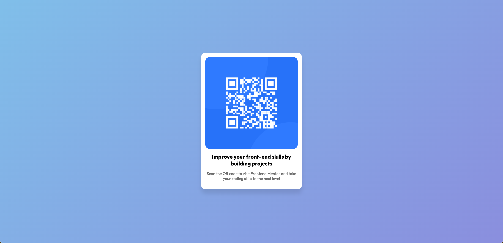

这是我为我的项目写的 readme 文档，请帮我整理一下

# Frontend Mentor - QR 码组件解决方案

这是 [Frontend Mentor 上 QR 码组件挑战](https://www.frontendmentor.io/challenges/qr-code-component-iux_sIO_H) 的解决方案。

## 目录

-   [概述](#概述)
    -   [截图](#截图)
-   [我的开发过程](#我的开发过程)
    -   [使用的技术](#使用的技术)
    -   [学到的知识](#学到的知识)
    -   [未来的改进方向](#未来的改进方向)
    -   [参考资料](#参考资料)

## 概述

### 截图




## 我的开发过程

### 使用的技术

-   语义化 HTML5 标记
-   CSS 自定义属性
-   Flexbox
-   移动端优先设计

### 学到的知识

-   使用`background`属性来创建渐变背景

```css
body {
    font-size: 15px;
    font-family: "Outfit", sans-serif;
    width: 100%;
    height: 100vh;
    background: linear-gradient(135deg, #8bc6ec 0%, #9599e2 100%);
    display: flex;
}
```

-   在父容器内使用 Flexbox 来布局内容，并在子容器用`margin`自动居中

```css
body {
    width: 100%;
    height: 100vh;
    display: flex;
}

.qr-code-container {
    margin: auto;
}
```

### 未来的改进方向

在本节中，你可以写下你未来想要继续改进的地方。例如：

-   希望进一步学习 CSS Grid 并在下一个项目中尝试使用它。
-   寻找更多关于动画效果的知识和可用的库，并在下个项目中应用。

### 参考资料

-   [居中元素](https://chokcoco.github.io/CSS-Inspiration/#/./layout/best-way-to-center-element)
-   [渐变生成器](https://cssgradient.io/gradient-backgrounds/)

---

[def]: #概述
